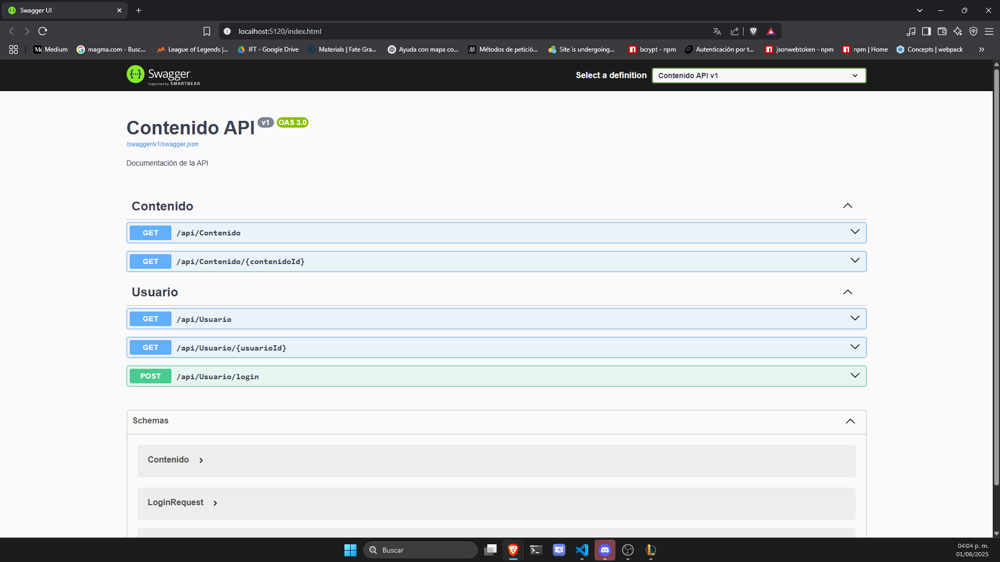
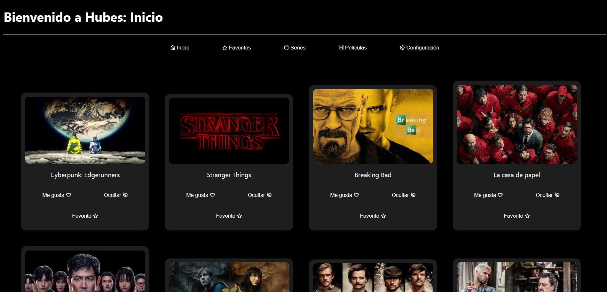
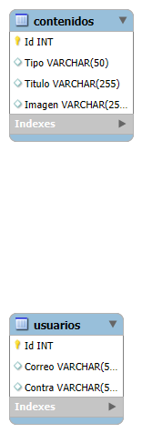

# 🎬 megaProyecto - Sprint 5  C#
**by Miguel Angel Gómez Romero**

Este es un proyecto web que simula una plataforma de streaming con navegación entre secciones como **Películas**, **Series**, **Favoritos** y **Configuración**.

---

## 🧪 Pruebas
Las pruebas unitarias fueron escritas utilizando el framework Jasmine y se ejecutan mediante el Karma Test Runner.

Para correr las pruebas:

ng test


ng test --code-coverage


---

## Swagger 🕶️

La API está documentada con Swagger. Puedes ver la interfaz interactiva accediendo a:
```bash
http://localhost:5120/index.html
```


---

## 📊 Sprint Review

Aquí está la presentación del Sprint 5, donde se muestran las tareas completadas y los próximos pasos. Puedes ver el documento completo a continuación:

[🔗 Ver presentación Sprint 5 (Google Slides)](https://docs.google.com/document/d/1jvX2du60K6qKAHkLOrE8So7O4oBX9OYkmCtNh-Hy7k0/edit?usp=sharing)

### ✅ Resumen breve del Sprint 5
- API en ASP.net o net core - MVC
- Conexión con el proyecto de Angular
- Implementación de login con Backend
- CORS
- Un solo Repo
- Mejoras propias

---

## 🚀 Características

Este proyecto fue generado con la versión **18.2.18** de Angular usando el [Angular CLI](https://github.com/angular/angular-cli).

- Navegación entre diferentes componentes
- Visualización de series y películas con imágenes
- Separación del contenido por tipo en archivos JSON
- Estilo limpio y responsivo

---

## 🗃️ Base de Datos - SQL Server

El directorio `Hubes/BaseDeDatos` contiene los archivos necesarios para crear y poblar la base de datos utilizada por la API.

### 📁 Archivos incluidos

- `schema.sql`: define la estructura de la base de datos (tablas, relaciones, etc.).
- `datos.sql`: carga de datos iniciales.
- `backup.sql` *(si aplica)*: respaldo completo de la base de datos.

Puedes ejecutar estos archivos en:

- **SQL Server Management Studio**


---

## 🔌 Backend - MegaApi (.NET)

El proyecto incluye una API desarrollada en **.NET** para servir datos desde la base de datos al frontend Angular.

### 📁 Ubicación del backend
`Hubes/MegaApi`

### ▶️ Cómo ejecutar la API

```bash
1. Entra al directorio de la API:

cd MegaApi

2. Ejecuta el servidor con:

dotnet run

3. La API quedará disponible en:

http://localhost:5120

```
---


## 📸 Vista previa - Mockups

- **Login**  
  

- **Inicio**  
  

- **Favoritos**  
  

- **Películas**  
  

- **Series**  
  

- **Configuración**  
  

---

## ❌ ¿Qué hice mal?
- Manejar los cambios directamente en la rama `main` ❎  
- No implementar correctamente la vista de las películas ❎
- Mal performance

---

## ✔️ ¿Qué hice bien?
- Implementar una vista agradable para las películas ✅  
- Implementar botones reactivos ✅  
- Seguir buenas prácticas de desarrollo ✅

---

## ⚙️ Tecnologías usadas
- Angular 18  
- HTML  
- CSS  
- TypeScript  
- SQL Server
- .NET(C#)

---

## 🛠️ Cómo instalar y correr el proyecto

### 📦 Requisitos
- Node.js >= 18
- Angular CLI (`npm install -g @angular/cli`) 18.2.18
- Navegador web actualizado (Chrome, Firefox, etc.)


## 🧩 Instalación y ejecución

### 1. Clona este repositorio
git clone https://github.com/MiguelAngelGRomero/megaProyecto.git

### 2. Entra al directorio del proyecto
cd megaProyecto

### 3. Instala las dependencias
npm install

### 4. Corre el servidor de desarrollo
ng serve

### 5. Abre tu navegador en
http://localhost:4200/


---

## 📁 Contenido JSON

- `contenido.json`: Incluye un listado mixto que distingue entre películas y series.

---

## 📐 Diagrama Entidad-Relación (prototipo)

Este es un primer borrador del diagrama E-R, Actualmente está en proceso de desarrollo.




### 📡 Rutas principales (API REST)

- Rutas:
  - `/api/contenido`
  - `/api/contenido/{contenidoId}`
  - `/api/Usuario`
  - `/api/Usuario/{UsuarioId}`
  - `/api/Usuario/login`